# 🧠⚡ **Kāraka NexusGraph**

<p align="center">
  
</p>

### *Agentic Intelligence, Deployed at Cloud Speed | NVIDIA NIM hosted on EKS*

[]()
[]()
[]()
[]()
[]()
[]()
[]()

> **For Judges:** [📖 Deployment Guide](./DEPLOYMENT-GUIDE.md) - Complete setup instructions for testing this project

---

## 🏎️ Overview

**Kāraka NexusGraph** is a full-stack **Agentic AI application** built for the 2025 NVIDIA × AWS Generative AI Hackathon. It showcases how **Llama-3.1 Nemotron-Nano 8B v1** (deployed as a NVIDIA NIM inference microservice) can power an **agentic reasoning system** hosted efficiently on **AWS EKS**, paired with a **Retrieval Embedding NIM** for contextual memory.

> 🪶 *Kāraka NexusGraph combines scalable cloud deployment with modular agentic reasoning — making intelligence fast, composable, and cloud-native.*

---

## The Problem with Traditional RAG

Today's AI retrieves by **keyword**. We retrieve by **meaning**.

Traditional Retrieval-Augmented Generation (RAG) is noisy because it pulls **text**, not **facts**. When you ask "Who replicated findings funded by the NIH?", keyword-based systems return entire paragraphs containing "NIH" and "replicated" — forcing the LLM to re-parse unstructured text, leading to hallucinations and imprecise answers.

## Our Solution: Kāraka Knowledge Graphs

We fix this by using **LLMs to map unstructured data into a deterministic Kāraka knowledge graph**. This builds a knowledge base on **how** and **why**, allowing an agent to retrieve structured, hallucination-free facts for precise answers.

### What is Kāraka Theory?

Kāraka (कारक) is a 2,500-year-old grammatical framework from Pāṇini's Sanskrit grammar that defines **semantic roles** in sentences:

- **Agent (Kartā)**: Who does the action
- **Object (Karma)**: What receives the action  
- **Instrument (Karaṇa)**: Tool/means used
- **Recipient (Sampradāna)**: Beneficiary/destination
- **Source (Apādāna)**: Origin/separation point
- **Locus (Adhikaraṇa)**: Where/when/what-about the action occurs

Unlike dependency parsing (which captures syntax), Kāraka captures **semantic intent** — the deep structure of meaning that remains constant across paraphrases.

### Architecture Overview

```mermaid
graph TB
    subgraph "Document Ingestion"
        A[Raw Document] -->|Upload| B[L1: Upload Handler]
        B -->|Store| C[S3: Raw Bucket]
        C -->|Trigger| D[L2: Validate Doc]
        D -->|LLM Verification| E[L3: Sanitize Doc]
        E -->|Split Sentences| F[S3: Verified Bucket]
    end
    
    subgraph "Knowledge Graph Construction (Step Functions)"
        F -->|Trigger| G[SFN: Per-Document Workflow]
        G -->|Get Sentences| H[L8: Get Sentences]
        
        H -->|For Each Sentence| I[Parallel Extraction]
        I -->|Extract| J[L9: Extract Entities]
        I -->|Extract| K[L10: Extract Kriyā]
        I -->|Embed| L[L8: Embedding Call]
        
        J & K -->|Build| M[L11: Build Events]
        M -->|Audit| N[L12: Audit Events]
        N -->|Extract| O[L13: Extract Relations]
        
        O -->|Store| P[L15: Graph Node Ops]
        O -->|Store| Q[L16: Graph Edge Ops]
        L -->|Store| R[S3: Embeddings]
    end
    
    subgraph "Query Processing"
        S[User Query] -->|Submit| T[L21: Query Submit]
        T -->|Process| U[L23: Query Processor]
        U -->|Embed Query| V[L8: Embedding Call]
        V -->|Retrieve| W[L17: Retrieve from Embedding]
        W -->|Graph Traversal| X[NetworkX Graph]
        X -->|Synthesize| Y[L18: Synthesize Answer]
        Y -->|LLM Call| Z[L7: LLM Call]
        Z -->|Return| AA[Structured Answer + Citations]
    end
    
    subgraph "Storage Layer"
        AB[(DynamoDB: Jobs)]
        AC[(DynamoDB: Sentences)]
        AD[(DynamoDB: LLM Logs)]
        AE[S3: Knowledge Graph]
    end
    
    subgraph "Model Infrastructure (EKS)"
        AF[NVIDIA NIM: Generator]
        AG[NVIDIA NIM: Embedder]
    end
    
    D -.->|Log| AD
    E -.->|Update| AB
    E -.->|Store| AC
    P & Q -.->|Store| AE
    Z -.->|Call| AF
    V & L -.->|Call| AG
```



---

## 🧩 Core Stack

| Layer | Technology | Purpose |
|-------|-------------|---------|
| **Inference** | `NVIDIA NIM: Llama-3.1-Nemotron-Nano-8B-v1` | Large-language reasoning engine |
| **Embedding / Retrieval** | `nvidia/llama-3.2-nv-embedqa-1b-v2` | Vector memory for contextual recall |
| **Compute Platform** | `AWS EKS` (AWS CDK provisioned) | Containerized microservice orchestration |
| **Orchestration** | `AWS Step Functions` | Agentic workflow coordination |
| **Serverless Compute** | `AWS Lambda (Python 3.12)` | Event-driven processing agents |
| **Storage** | `AWS S3 + DynamoDB` | Document storage + metadata |
| **Monitoring / Logging** | `CloudWatch` | Usage tracking + observability |
| **API Layer** | `AWS API Gateway` | RESTful endpoints for frontend |
| **Graph Operations** | `NetworkX` | Knowledge graph structure |
| **Frontend (UI)** | `React` | Interactive visualization & query interface |
| **IaC** | `AWS CDK (Python)` | Automated, reproducible infra setup |

---

## 🚀 Features

- ⚙️ **Agentic AI Core** – Modular reasoning agents coordinated via AWS Step Functions
- ☁️ **NVIDIA NIM Inference** – Runs Llama 3.1 Nano 8B as a microservice on EKS
- 🧭 **Retrieval Embedding Memory** – Uses nv-embedqa NIM for contextual grounding
- 📊 **AWS Native Infra** – Scalable, monitored, cost-controlled Kubernetes cluster
- 🔄 **Iterative Validation** – LLM-driven quality assurance with retry logic
- 🎯 **Semantic Role Labeling** – Kāraka theory for precise fact extraction
- 💬 **Structured Evidence Retrieval** – Graph traversal for hallucination-free answers
- 🛠️ **Infrastructure as Code** – AWS CDK for EKS, Lambda, DynamoDB, S3
- 📈 **Observability Tools** – Processing chain visualization and LLM call logs

---

## 🛠️ Tools & Technologies Deep Dive

### NVIDIA NIM (NVIDIA Inference Microservices)
- **Generator Model**: `llama-3.1-nemotron-nano-8b-v1`
  - Deployed as containerized microservice on EKS
  - Handles all LLM reasoning tasks (entity extraction, validation, synthesis)
  - OpenAI-compatible API endpoints
- **Embedder Model**: `llama-3.2-nv-embedqa-1b-v2`
  - Generates 2048-dimensional embeddings
  - Powers semantic search and retrieval
  - Optimized for query-document matching

### AWS Services Architecture
- **EKS (Elastic Kubernetes Service)**
  - 2x g5.xlarge GPU nodes (NVIDIA A10G)
  - Auto-scaling node groups
  - Managed Kubernetes control plane
- **Lambda Functions** (18 total)
  - Python 3.12 runtime
  - Reserved concurrency for LLM calls (3) and RAG queries (2 each)
  - Custom layer with requests, networkx, numpy
- **Step Functions**
  - Per-document workflow orchestration
  - Map state for parallel sentence processing
  - Max concurrency = 1 to prevent LLM overload
- **DynamoDB**
  - Jobs table: Document processing status
  - Sentences table: Sentence metadata with GSI by job_id
  - LLM Logs table: Complete audit trail with GSIs
- **S3 Buckets**
  - Raw documents bucket
  - Verified documents bucket
  - Knowledge graph bucket (nodes.json, edges.json, embeddings)

### Agentic Pipeline Components
1. **Document Lifecycle Agents** (L1-L4)
   - Upload handler, validator, sanitizer, status tracker
2. **Knowledge Graph Extraction Agents** (L9-L14)
   - Entity extractor, Kriyā extractor, event builder, auditor, relation extractor, attribute extractor
3. **Graph Operations** (L15-L16)
   - Node operations (NetworkX graph construction)
   - Edge operations (Kāraka links + relations)
4. **RAG Agents** (L17-L18, L21-L23)
   - Embedding retrieval, answer synthesis, query processor
5. **Observability Tools** (L19-L20)
   - Processing chain viewer, sentence chain viewer

---

## The Kāraka RAG Pipeline

### Phase 1: Document Ingestion & Validation
1. **Upload Handler**: Generates pre-signed S3 URL for document upload
2. **Validate Doc**: LLM verifies document quality and coherence
3. **Sanitize Doc**: Splits document into atomic sentences using LLM

### Phase 2: Knowledge Graph Construction (Per Sentence)
For each sentence, we run a **deterministic extraction pipeline**:

#### Step 1: Parallel Extraction
- **Extract Entities** (L9): Identify all nouns/entities
- **Extract Kriyā** (L10): Identify verbs and their voice (active/passive)
- **Generate Embedding** (L8): Create vector representation

#### Step 2: Event Instance Creation
- **Build Events** (L11): Create event instances with Kāraka links
  - Maps entities to semantic roles (Agent, Object, Instrument, etc.)
  - Handles passive voice transformations
  - Distinguishes Locus types (Space, Time, Topic)

#### Step 3: Quality Assurance
- **Audit Events** (L12): LLM validates Kāraka assignments
  - Checks for Locus misclassification (most common error)
  - Verifies passive voice handling
  - Ensures no invented entities
  - Iterative retry until score = 100

#### Step 4: Relationship Extraction
- **Extract Relations** (L13): Finds non-Kāraka relationships
  - Sambandha (Relations): "with", "of", "between" connections
  - Sāmānādhikaraṇya (Characteristics): Appositive phrases
  - Compound Events: Sequential actions by same agent

#### Step 5: Graph Storage
- **Graph Node Ops** (L15): Stores entities and events as nodes
- **Graph Edge Ops** (L16): Stores Kāraka links and relations as edges
- Uses **NetworkX** for graph operations
- Stored in S3 as JSON (nodes.json, edges.json)

### Phase 3: Query Processing (RAG)

When a user asks a question:

1. **Query Submit** (L21): Accepts query, returns query_id
2. **Query Processor** (L23): Orchestrates retrieval
   - Embeds query using NVIDIA NIM Embedder
   - Retrieves top-k semantically similar sentences
   - Traverses knowledge graph to find connected facts
3. **Retrieve from Embedding** (L17): Cosine similarity search
4. **Synthesize Answer** (L18): LLM generates answer using:
   - **Structured Evidence**: Facts from knowledge graph with semantic roles
   - **Retrieved Sentences**: Original text for context
   - **Citations**: Every fact cited with source (doc_id:sentence_id)

## Why This Reduces Hallucinations

Traditional RAG:
```
Query: "Who replicated NIH-funded findings?"
Retrieved: [3 paragraphs of text mentioning NIH and replication]
LLM: *re-parses text, may hallucinate connections*
```

Kāraka RAG:
```
Query: "Who replicated NIH-funded findings?"
Retrieved Structured Facts:
  - Event: "was funded" → Agent: "NIH", Object: "gut-brain research"
  - Event: "replicated" → Agent: "Maria Santos", Object: "findings on gut-brain"
LLM: *synthesizes from structured facts only*
Answer: "Maria Santos replicated the NIH-funded findings (doc1:s3)"
```

The knowledge graph provides:
- **Deterministic facts** (not ambiguous text)
- **Semantic roles** (who did what to whom)
- **Provenance** (every fact traceable to source sentence)
- **Structured context** (LLM can't invent connections)

## Technology Stack

### Infrastructure
- **AWS CDK**: Infrastructure as Code (Python)
- **AWS EKS**: Kubernetes cluster for GPU workloads
- **AWS Lambda**: Serverless compute (Python 3.12)
- **AWS Step Functions**: Orchestration of KG construction
- **AWS DynamoDB**: Metadata storage
- **AWS S3**: Document and graph storage

### AI/ML
- **NVIDIA NIM**: Containerized model inference
  - Generator: `llama-3.1-nemotron-nano-8b-v1`
  - Embedder: `llama-3.2-nv-embedqa-1b-v2`
- **NetworkX**: Graph data structure and operations
- **NumPy**: Vector operations for embeddings

### Compute Resources
- **GPU Nodes**: 2x g5.xlarge (NVIDIA A10G)
- **Lambda Concurrency**: 
  - LLM calls: 3 reserved
  - RAG queries: 2 reserved per function
- **Step Functions**: Max concurrency = 1 (prevents LLM overload)

## Hackathon Scope: Proof of Concept

This hackathon project demonstrates the **core hypothesis**:

✅ **What We Built:**
- Complete document ingestion pipeline
- LLM-driven Kāraka extraction with iterative validation
- Knowledge graph construction (entities, events, relations)
- Semantic retrieval with graph traversal
- Answer synthesis with structured evidence + citations

🚧 **Future Work (Beyond Hackathon):**
- Multi-hop reasoning across documents
- Temporal reasoning (event sequences)
- Contradiction detection
- Graph visualization UI
- Advanced query decomposition
- Coreference resolution across sentences

## Key Prompts

Our system uses carefully engineered prompts for each extraction step:

- **Entity Extraction** (`entity_prompt.txt`): Identifies all nouns
- **Kriyā Extraction** (`kriya_extraction_prompt.txt`): Identifies verbs and voice
- **Event Instance Creation** (`event_instance_prompt.txt`): Maps Kāraka roles
- **Auditor** (`auditor_prompt.txt`): Validates semantic correctness
- **Relation Extraction** (`relation_prompt.txt`): Finds non-Kāraka relationships
- **Answer Synthesis** (`answer_synthesizer_prompt.txt`): Generates cited answers

All prompts are stored in `prompts/` and synced to S3 during deployment.

## Testing the System

### 1. Deploy Infrastructure
See [DEPLOYMENT-GUIDE.md](./DEPLOYMENT-GUIDE.md) for complete setup instructions.

### 2. Upload a Document
```bash
./test-fresh-upload.sh
```

### 3. Monitor Processing
```bash
# Check sentence processing status
python check-sentence-status.py

# View processing chain for a sentence
curl "$API_URL/processing-chain?sentence_hash=<hash>"
```

### 4. Query the Knowledge Graph
```bash
./test-query-api.sh
```

Example query: "Who collaborated on neuroplasticity research?"

Response:
```json
{
  "query_id": "q_abc123",
  "status": "completed",
  "answer": "Dr. Elena Kowalski collaborated with Dr. James Chen on a groundbreaking study examining neuroplasticity (doc1:s2).",
  "structured_evidence": [
    {
      "event": "collaborated",
      "agent": "Dr. Elena Kowalski",
      "locus_topic": "a groundbreaking study",
      "source": "doc1:s2"
    }
  ]
}
```

## Project Structure

```
.
├── app.py                          # CDK app entry point
├── nvidia_aws_agentic_ai/          # CDK stack definitions
│   ├── serverless_stack.py        # Lambda, DynamoDB, API Gateway
│   └── eks_stack.py                # EKS cluster, GPU nodes, NIM models
├── src/lambda_src/                 # Lambda function code
│   ├── job_mgmt/                   # Document lifecycle management
│   ├── kg_agents/                  # Knowledge graph extraction agents
│   ├── graph_ops/                  # NetworkX graph operations
│   ├── rag/                        # Retrieval and synthesis
│   └── api_tools/                  # Observability and query APIs
├── prompts/                        # LLM prompts for each agent
├── lambda_layer/                   # Python dependencies (requests, networkx, numpy)
├── deploy-model.sh                 # Deploy EKS + NVIDIA NIM models
├── deploy-backend.sh               # Deploy serverless backend
├── test-model-endpoints.sh         # Test NVIDIA NIM endpoints
├── test-query-api.sh               # Test RAG query flow
└── DEPLOYMENT-GUIDE.md             # Setup instructions for judges
```

## Team & Acknowledgments

This project was built for the **NVIDIA + AWS Generative AI Hackathon**.

**Core Innovation:**
- Application of ancient Pāṇinian grammar to modern knowledge graphs
- LLM-driven semantic extraction with iterative validation
- Structured evidence retrieval for hallucination reduction

**Technologies:**
- NVIDIA NIM for efficient model inference
- AWS serverless architecture for scalability
- Kāraka theory for semantic role labeling

## License

This project is submitted for the NVIDIA + AWS Generative AI Hackathon.

---

**The Fountain of Intellect**: Where 2,500-year-old linguistic theory meets cutting-edge AI to build knowledge graphs that think like humans do.
