# Complex Example: Complete Graph Visualization

## Full Graph Structure (CORRECT: Single Entity Nodes)

```mermaid
flowchart TD
    %% Entity Nodes (Created ONCE)
    E_Rama[Entity: Rama<br/>ONE NODE]
    E_Shiva[Entity: Shiva<br/>ONE NODE]
    E_Pinaka[Entity: Pinaka<br/>ONE NODE]
    E_Lakshmana[Entity: Lakshmana<br/>ONE NODE]
    E_BowL[Entity: bow_lakshmana<br/>ONE NODE]
    E_Agastya[Entity: Agastya<br/>ONE NODE]
    E_Kodanda[Entity: Kodanda<br/>ONE NODE]
    E_Ravana[Entity: Ravana<br/>ONE NODE]

    %% Action Nodes
    A0[Action: presented<br/>line: 1, seq: 0]
    A1[Action: accepted<br/>line: 2, seq: 0]
    A2[Action: found<br/>line: 3, seq: 0]
    A3[Action: gave<br/>line: 4, seq: 0]
    A4[Action: arrived<br/>line: 5, seq: 0]
    A5[Action: advised<br/>line: 6, seq: 0]
    A6[Action: presented<br/>line: 7, seq: 0]
    A7[Action: kill<br/>line: 8, seq: 0]

    %% Sentence 0: Shiva presented Pinaka to Rama
    A0 -->|KARTA| E_Shiva
    A0 -->|KARMA| E_Pinaka
    A0 -->|SAMPRADANA| E_Rama

    %% Sentence 1: Rama accepted it
    A1 -->|KARTA| E_Rama
    A1 -->|KARMA| E_Pinaka

    %% Sentence 2: Lakshmana found bow cracked
    A2 -->|KARTA| E_Lakshmana
    A2 -->|KARMA| E_BowL

    %% Sentence 3: Rama gave Pinaka to Lakshmana
    A3 -->|KARTA| E_Rama
    A3 -->|KARMA| E_Pinaka
    A3 -->|SAMPRADANA| E_Lakshmana

    %% Sentence 4: Agastya arrived
    A4 -->|KARTA| E_Agastya

    %% Sentence 5: Agastya advised Rama
    A5 -->|KARTA| E_Agastya
    A5 -->|KARMA| E_Rama

    %% Sentence 6: Agastya presented Kodanda to Rama
    A6 -->|KARTA| E_Agastya
    A6 -->|KARMA| E_Kodanda
    A6 -->|SAMPRADANA| E_Rama

    %% Sentence 7: Rama killed Ravana using Kodanda
    A7 -->|KARTA| E_Rama
    A7 -->|KARMA| E_Ravana
    A7 -->|KARANA| E_Kodanda

    style A0 fill:#fff9e6
    style A1 fill:#fff9e6
    style A2 fill:#fff9e6
    style A3 fill:#fff9e6
    style A4 fill:#fff9e6
    style A5 fill:#fff9e6
    style A6 fill:#fff9e6
    style A7 fill:#fff9e6

    style E_Shiva fill:#e1f5ff
    style E_Rama fill:#ffe1e1
    style E_Pinaka fill:#f0e1ff
    style E_Lakshmana fill:#e1ffe1
    style E_BowL fill:#fff4e1
    style E_Agastya fill:#e1e1ff
    style E_Kodanda fill:#ffe1f0
    style E_Ravana fill:#ffcccc
```



## Key Observations

### 1. ONE Entity Node Per Unique Entity ✓
- **Rama**: Created ONCE, linked by 6 different actions
- **Pinaka**: Created ONCE, linked by 3 different actions
- **Kodanda**: Created ONCE, linked by 2 different actions
- **Agastya**: Created ONCE, linked by 3 different actions
- **Lakshmana**: Created ONCE, linked by 2 different actions

### 2. Actions are Centers
Each action (yellow boxes) is the center that binds entities through Kāraka relationships.

### 3. No Direct Entity Links
- Rama and Lakshmana are NOT directly connected
- Pinaka and Kodanda are NOT directly connected
- Entities only relate through actions

### 4. Multiple Relationships to Same Entity
The SAME Rama entity node has:
- `(action_0)-[:SAMPRADANA]->(Rama)` - recipient from Shiva
- `(action_1)-[:KARTA]->(Rama)` - agent accepting
- `(action_3)-[:KARTA]->(Rama)` - agent giving
- `(action_5)-[:KARMA]->(Rama)` - patient being advised
- `(action_6)-[:SAMPRADANA]->(Rama)` - recipient from Agastya
- `(action_7)-[:KARTA]->(Rama)` - agent killing

**Six relationships, ONE entity node.**

### 5. Different Roles for Same Entity
- Rama is SAMPRADANA in sentences 0, 6 (recipient)
- Rama is KARTA in sentences 1, 3, 7 (agent)
- Rama is KARMA in sentence 5 (patient)

### 6. Temporal Flow
- line_number provides chronological ordering (1-8)
- action_sequence orders multiple verbs within same line
- Can trace object movement through time
- Can answer "who has X now?"

### 7. Distinguishing Similar Objects
- Pinaka (Shiva's bow) - ONE separate entity node
- Kodanda (Agastya's bow) - ONE separate entity node
- bow_lakshmana (Lakshmana's broken bow) - ONE separate entity node

## Example Queries

### Query 1: Who gave Pinaka to Rama?
```cypher
MATCH (a:Action)-[:KARTA]->(giver:Entity)
WHERE a.verb IN ['gave', 'presented']
MATCH (a)-[:KARMA]->(pinaka:Entity {canonical_name: 'Pinaka'})
MATCH (a)-[:SAMPRADANA]->(rama:Entity {canonical_name: 'Rama'})
RETURN giver.canonical_name, a.document_id, a.line_number

// Retrieve sentence text separately from document storage
```
**Answer:** Shiva (document: doc_123, line: 1)

### Query 2: What weapon did Rama use to kill Ravana?
```cypher
MATCH (a:Action)-[:KARANA]->(weapon:Entity)
WHERE a.verb = 'kill'
MATCH (a)-[:KARTA]->(rama:Entity {canonical_name: 'Rama'})
MATCH (a)-[:KARMA]->(ravana:Entity {canonical_name: 'Ravana'})
RETURN weapon.canonical_name, a.sentence, a.line_number
```
**Answer:** Kodanda (Line 8)

### Query 3: Did Rama use Pinaka to kill Ravana? (No Answer)
```cypher
MATCH (a:Action)-[:KARANA]->(pinaka:Entity {canonical_name: 'Pinaka'})
WHERE a.verb = 'kill'
MATCH (a)-[:KARTA]->(rama:Entity {canonical_name: 'Rama'})
RETURN a.sentence
```
**Answer:** NULL (No matching relationship found)
**Related:** Rama used Kodanda (not Pinaka) to kill Ravana

### Query 4: Trace Pinaka's journey
```cypher
MATCH (a:Action)-[r]->(pinaka:Entity {canonical_name: 'Pinaka'})
MATCH (a)-[:KARTA]->(agent:Entity)
OPTIONAL MATCH (a)-[:SAMPRADANA]->(recipient:Entity)
RETURN a.sentence_id, agent.canonical_name, a.verb, type(r), recipient.canonical_name
ORDER BY a.sentence_id
```
**Answer:**
1. Shiva presented (KARMA) to Rama
2. Rama accepted (KARMA)
3. Rama gave (KARMA) to Lakshmana


## Actual Neo4j Database Structure

### Entity Nodes (Created ONCE Each)

```cypher
// 8 Entity nodes total
(:Entity {canonical_name: 'Rama', aliases: ['Rama', 'he'], document_ids: ['doc_123']})
(:Entity {canonical_name: 'Shiva', aliases: ['Shiva', 'Lord Shiva'], document_ids: ['doc_123']})
(:Entity {canonical_name: 'Pinaka', aliases: ['Pinaka', 'it', 'the Pinaka'], document_ids: ['doc_123']})
(:Entity {canonical_name: 'Lakshmana', aliases: ['Lakshmana'], document_ids: ['doc_123']})
(:Entity {canonical_name: 'bow_lakshmana', aliases: ['bow', 'his own bow'], document_ids: ['doc_123']})
(:Entity {canonical_name: 'Agastya', aliases: ['Agastya', 'He', 'the sage Agastya'], document_ids: ['doc_123']})
(:Entity {canonical_name: 'Kodanda', aliases: ['Kodanda', 'the Kodanda'], document_ids: ['doc_123']})
(:Entity {canonical_name: 'Ravana', aliases: ['Ravana'], document_ids: ['doc_123']})
```

### Action Nodes (8 Total)

```cypher
(:Action {id: 'action_0', verb: 'presented', sentence_id: 0, line_number: 1, ...})
(:Action {id: 'action_1', verb: 'accepted', sentence_id: 1, line_number: 2, ...})
(:Action {id: 'action_2', verb: 'found', sentence_id: 2, line_number: 3, ...})
(:Action {id: 'action_3', verb: 'gave', sentence_id: 3, line_number: 4, ...})
(:Action {id: 'action_4', verb: 'arrived', sentence_id: 4, line_number: 5, ...})
(:Action {id: 'action_5', verb: 'advised', sentence_id: 5, line_number: 6, ...})
(:Action {id: 'action_6', verb: 'presented', sentence_id: 6, line_number: 7, ...})
(:Action {id: 'action_7', verb: 'kill', sentence_id: 7, line_number: 8, ...})
```

### Relationships (19 Total)

All relationships point FROM Action TO Entity:

```cypher
// Sentence 0: Shiva presented Pinaka to Rama
(action_0)-[:KARTA {confidence: 0.95, source_sentence_id: 0}]->(Shiva)
(action_0)-[:KARMA {confidence: 0.95, source_sentence_id: 0}]->(Pinaka)
(action_0)-[:SAMPRADANA {confidence: 0.95, source_sentence_id: 0}]->(Rama)

// Sentence 1: Rama accepted it
(action_1)-[:KARTA {confidence: 0.95, source_sentence_id: 1}]->(Rama)
(action_1)-[:KARMA {confidence: 0.90, source_sentence_id: 1}]->(Pinaka)

// Sentence 2: Lakshmana found bow cracked
(action_2)-[:KARTA {confidence: 0.95, source_sentence_id: 2}]->(Lakshmana)
(action_2)-[:KARMA {confidence: 0.95, source_sentence_id: 2}]->(bow_lakshmana)

// Sentence 3: Rama gave Pinaka to Lakshmana
(action_3)-[:KARTA {confidence: 0.95, source_sentence_id: 3}]->(Rama)
(action_3)-[:KARMA {confidence: 0.95, source_sentence_id: 3}]->(Pinaka)
(action_3)-[:SAMPRADANA {confidence: 0.95, source_sentence_id: 3}]->(Lakshmana)

// Sentence 4: Agastya arrived
(action_4)-[:KARTA {confidence: 0.95, source_sentence_id: 4}]->(Agastya)

// Sentence 5: Agastya advised Rama
(action_5)-[:KARTA {confidence: 0.90, source_sentence_id: 5}]->(Agastya)
(action_5)-[:KARMA {confidence: 0.95, source_sentence_id: 5}]->(Rama)

// Sentence 6: Agastya presented Kodanda to Rama
(action_6)-[:KARTA {confidence: 0.95, source_sentence_id: 6}]->(Agastya)
(action_6)-[:KARMA {confidence: 0.95, source_sentence_id: 6}]->(Kodanda)
(action_6)-[:SAMPRADANA {confidence: 0.95, source_sentence_id: 6}]->(Rama)

// Sentence 7: Rama killed Ravana using Kodanda
(action_7)-[:KARTA {confidence: 0.95, source_sentence_id: 7}]->(Rama)
(action_7)-[:KARMA {confidence: 0.95, source_sentence_id: 7}]->(Ravana)
(action_7)-[:KARANA {confidence: 0.95, source_sentence_id: 7}]->(Kodanda)
```

### Total Graph Size

- **8 Entity nodes** (created once each)
- **8 Action nodes** (one per sentence)
- **19 Relationships** (Action → Entity)

### Example: Rama Entity Node

The SINGLE Rama entity node has **6 incoming relationships** from different actions:

```cypher
MATCH (rama:Entity {canonical_name: 'Rama'})<-[r]-(a:Action)
RETURN a.sentence_id, type(r), a.verb
ORDER BY a.sentence_id
```

**Result:**
```
sentence_id | relationship | verb
------------|--------------|----------
0           | SAMPRADANA   | presented
1           | KARTA        | accepted
3           | KARTA        | gave
5           | KARMA        | advised
6           | SAMPRADANA   | presented
7           | KARTA        | kill
```

**One entity node, six different relationships, playing different Kāraka roles.**

### Example: Pinaka Entity Node

The SINGLE Pinaka entity node has **3 incoming relationships**:

```cypher
MATCH (pinaka:Entity {canonical_name: 'Pinaka'})<-[r]-(a:Action)
RETURN a.sentence_id, type(r), a.verb
ORDER BY a.sentence_id
```

**Result:**
```
sentence_id | relationship | verb
------------|--------------|----------
0           | KARMA        | presented
1           | KARMA        | accepted
3           | KARMA        | gave
```

**One entity node, three relationships, always as KARMA (object being transferred).**

## Implementation: Entity Resolution Logic

```python
def resolve_entity(entity_mention: str, document_id: str) -> str:
    """
    Returns canonical name of existing entity OR creates new one.
    NEVER creates duplicate entity nodes.
    """
    # Check if entity already exists
    existing = neo4j.run("""
        MATCH (e:Entity)
        WHERE toLower(e.canonical_name) = toLower($mention)
           OR toLower($mention) IN [toLower(alias) FOR alias IN e.aliases]
        RETURN e.canonical_name AS canonical_name
        LIMIT 1
    """, mention=entity_mention).single()
    
    if existing:
        # Entity exists, return canonical name
        return existing["canonical_name"]
    
    # Check embedding similarity with existing entities
    mention_embedding = get_embedding(entity_mention)
    similar = neo4j.run("""
        MATCH (e:Entity)
        RETURN e.canonical_name AS name, 
               e.embedding AS embedding
    """)
    
    for record in similar:
        similarity = cosine_similarity(mention_embedding, record["embedding"])
        if similarity > 0.85:
            # Same entity, different mention
            # Add to aliases and return canonical name
            neo4j.run("""
                MATCH (e:Entity {canonical_name: $name})
                SET e.aliases = e.aliases + $mention
                SET e.document_ids = 
                    CASE WHEN $doc_id IN e.document_ids 
                    THEN e.document_ids 
                    ELSE e.document_ids + $doc_id 
                    END
            """, name=record["name"], mention=entity_mention, doc_id=document_id)
            return record["name"]
    
    # New entity, create it
    canonical_name = entity_mention
    neo4j.run("""
        CREATE (e:Entity {
            canonical_name: $name,
            aliases: [$name],
            document_ids: [$doc_id],
            embedding: $embedding,
            created_at: timestamp()
        })
    """, name=canonical_name, doc_id=document_id, embedding=mention_embedding)
    
    return canonical_name
```

### Creating Relationships

```python
def create_karaka_relationship(action_id: str, karaka: str, entity_canonical_name: str, 
                               confidence: float, sentence_id: int, doc_id: str):
    """
    Creates relationship FROM action TO existing entity.
    Entity must already exist.
    """
    neo4j.run("""
        MATCH (a:Action {id: $action_id})
        MATCH (e:Entity {canonical_name: $entity_name})
        CREATE (a)-[r:$karaka {
            confidence: $confidence,
            source_sentence_id: $sentence_id,
            document_id: $doc_id,
            created_at: timestamp()
        }]->(e)
    """, action_id=action_id, karaka=karaka, entity_name=entity_canonical_name,
         confidence=confidence, sentence_id=sentence_id, doc_id=doc_id)
```

## Summary

**CRITICAL: Each unique entity is stored as ONE node in Neo4j.**

- Multiple actions can link to the same entity node
- Same entity can play different Kāraka roles in different actions
- Entity resolution ensures "Rama", "he", etc. all point to the SAME Rama node
- This enables efficient querying and prevents data duplication

The diagram above now correctly shows this structure with single entity nodes connected to multiple actions.
