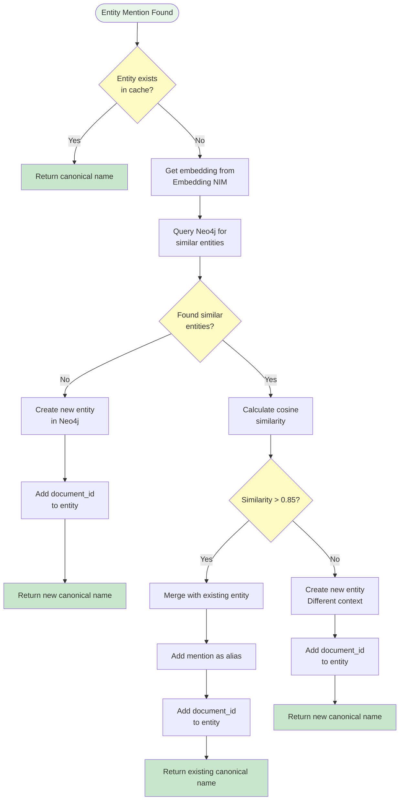

# Entity Resolution Algorithm

```mermaid
flowchart TD
    Start([Entity Mention Found]) --> Check{Entity exists<br/>in cache?}
    
    Check -->|Yes| Return1[Return canonical name]
    Check -->|No| GetEmbed[Get embedding from<br/>Embedding NIM]
    
    GetEmbed --> QueryNeo[Query Neo4j for<br/>similar entities]
    QueryNeo --> HasSimilar{Found similar<br/>entities?}
    
    HasSimilar -->|No| CreateNew[Create new entity<br/>in Neo4j]
    CreateNew --> AddDoc1[Add document_id<br/>to entity]
    AddDoc1 --> Return2[Return new canonical name]
    
    HasSimilar -->|Yes| CalcSim[Calculate cosine<br/>similarity]
    CalcSim --> CheckThresh{Similarity > 0.85?}
    
    CheckThresh -->|Yes| Merge[Merge with existing entity]
    Merge --> AddAlias[Add mention as alias]
    AddAlias --> AddDoc2[Add document_id<br/>to entity]
    AddDoc2 --> Return3[Return existing canonical name]
    
    CheckThresh -->|No| CreateDiff[Create new entity<br/>Different context]
    CreateDiff --> AddDoc3[Add document_id<br/>to entity]
    AddDoc3 --> Return4[Return new canonical name]

    style Start fill:#e8f5e9
    style Return1 fill:#c8e6c9
    style Return2 fill:#c8e6c9
    style Return3 fill:#c8e6c9
    style Return4 fill:#c8e6c9
    style Check fill:#fff9c4
    style HasSimilar fill:#fff9c4
    style CheckThresh fill:#fff9c4
```
