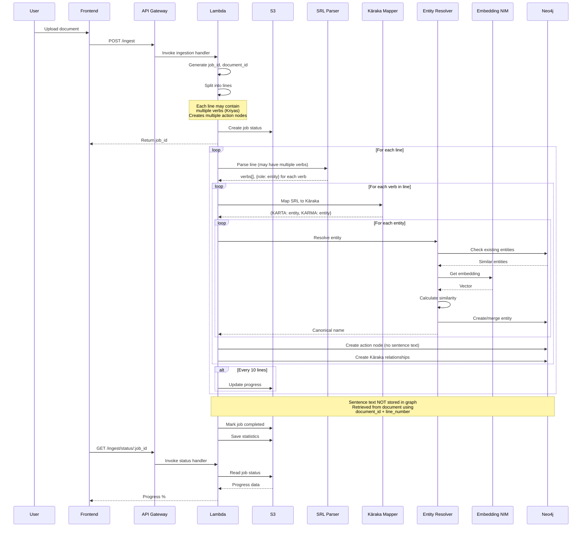

# Document Ingestion Flow

```mermaid
sequenceDiagram
    participant User
    participant Frontend
    participant API Gateway
    participant Lambda
    participant S3
    participant SRL Parser
    participant Kāraka Mapper
    participant Entity Resolver
    participant Embedding NIM
    participant Neo4j

    User->>Frontend: Upload document
    Frontend->>API Gateway: POST /ingest
    API Gateway->>Lambda: Invoke ingestion handler
    Lambda->>Lambda: Generate job_id, document_id
    Lambda->>Lambda: Split into lines
    Note over Lambda: Each line may contain<br/>multiple verbs (Kriyas)<br/>Creates multiple action nodes
    Lambda->>S3: Create job status
    Lambda-->>Frontend: Return job_id

    loop For each line
        Lambda->>SRL Parser: Parse line (may have multiple verbs)
        SRL Parser-->>Lambda: verbs[], {role: entity} for each verb
        
        loop For each verb in line
            Lambda->>Kāraka Mapper: Map SRL to Kāraka
            Kāraka Mapper-->>Lambda: {KARTA: entity, KARMA: entity}
        
        loop For each entity
            Lambda->>Entity Resolver: Resolve entity
            Entity Resolver->>Neo4j: Check existing entities
            Neo4j-->>Entity Resolver: Similar entities
            Entity Resolver->>Embedding NIM: Get embedding
            Embedding NIM-->>Entity Resolver: Vector
            Entity Resolver->>Entity Resolver: Calculate similarity
            Entity Resolver->>Neo4j: Create/merge entity
            Entity Resolver-->>Lambda: Canonical name
        end

            Lambda->>Neo4j: Create action node (no sentence text)
            Lambda->>Neo4j: Create Kāraka relationships
        end
        
        alt Every 10 lines
            Lambda->>S3: Update progress
        end
    end
    
    Note over Lambda,Neo4j: Sentence text NOT stored in graph<br/>Retrieved from document using<br/>document_id + line_number

    Lambda->>S3: Mark job completed
    Lambda->>S3: Save statistics

    Frontend->>API Gateway: GET /ingest/status/:job_id
    API Gateway->>Lambda: Invoke status handler
    Lambda->>S3: Read job status
    S3-->>Lambda: Progress data
    Lambda-->>Frontend: Progress %
```
