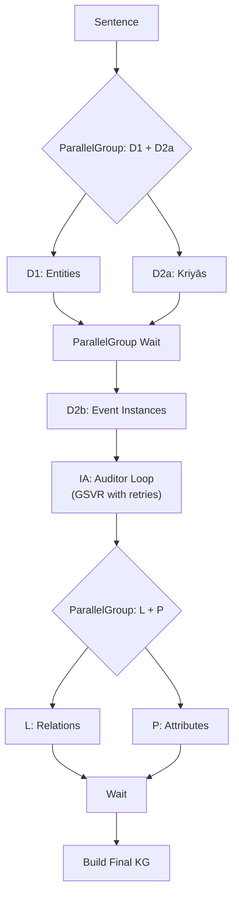
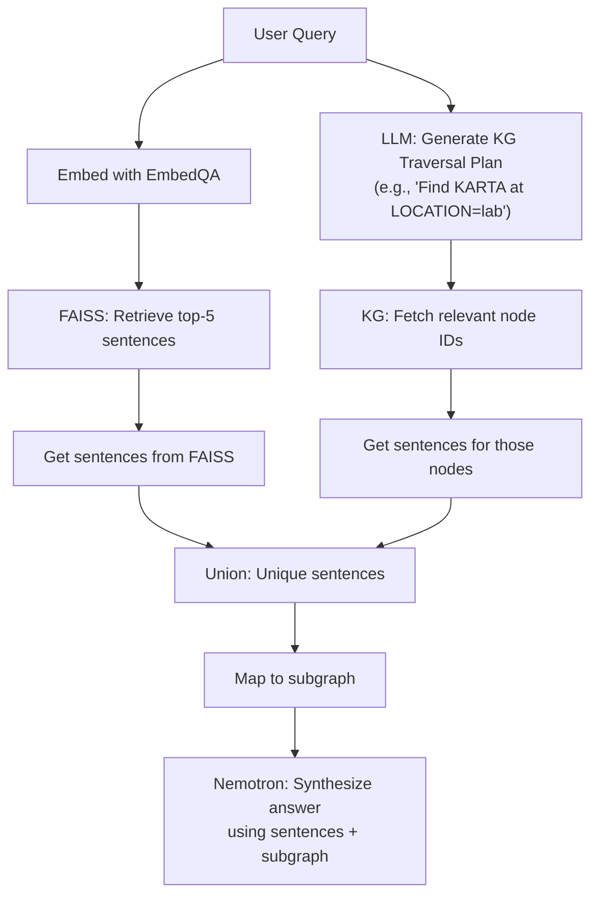

# Graph creation flow

```mermaid
flowchart TD
    A["📥 Input Sentence"] --> B["🔧 Preprocess: Sentence Splitter\n(100% fidelity)"]
    B --> C["✓ Verified Sentence\n(Ground Truth)"]

    %% Entity Extraction Pipeline
    subgraph D1_Pipeline["🔷 D1: Entity Extraction"]
        C --> D1_Gen["🧠 D1 Generate\n(Entity Agent)"]
        D1_Gen --> D1_Score["📊 Score: Programmatic\nAll entities in sentence?\n(string.includes check)"]
        D1_Score -->|Score ≥ 95| D1_Accept["✅ Accept Entities"]
        D1_Score -->|Score < 95| D1_Retry{"Retry Count < 3?"}
        D1_Retry -->|Yes| D1_Gen
        D1_Retry -->|No| D1_Best["🔝 Use Best Attempt\n(Highest score so far)"]
        D1_Best --> D1_Accept
    end

    %% Kriyā Concept Pipeline
    subgraph D2a_Pipeline["🔶 D2a: Kriyā Concepts"]
        C --> D2a_Gen["🧠 D2a Generate\n(Kriyā Agent)"]
        D2a_Gen --> D2a_Score["📊 Score: Programmatic\nVerbs in sentence?\nLemma validity check"]
        D2a_Score -->|Score ≥ 95| D2a_Accept["✅ Accept Kriyās"]
        D2a_Score -->|Score < 95| D2a_Retry{"Retry Count < 3?"}
        D2a_Retry -->|Yes| D2a_Gen
        D2a_Retry -->|No| D2a_Best["🔝 Use Best Attempt"]
        D2a_Best --> D2a_Accept
    end

    %% Event + Kāraka Pipeline (with LLM Auditor)
    subgraph D2b_IA_Pipeline["🟣 D2b + IA: Events & Kāraka"]
        D1_Accept --> D2b_Input
        D2a_Accept --> D2b_Input
        D2b_Input["📦 Inputs:\n- Entities\n- Kriyās"] --> D2b_Gen["🧠 D2b Generate\n(Event + Kāraka Links)"]
        D2b_Gen --> IA_Audit["🤖 IA Audit\n(LLM Semantic Validator)"]
        IA_Audit -->|Score = 100| D2b_Accept["✅ Accept Event Instances"]
        IA_Audit -->|Score = 0| IA_Retry{"Retry Count < 3?"}
        IA_Retry -->|Yes| D2b_Gen
        IA_Retry -->|No| IA_Best["🔝 Use Best Attempt\n(Most recent or highest score)"]
        IA_Best --> D2b_Accept
    end

    %% Relation Pipeline
    subgraph L_Pipeline["🟢 L: Relations (Sambandha)"]
        D2b_Accept --> L_Input["📦 Inputs:\n- Entities\n- Event Instances"]
        L_Input --> L_Gen["🧠 L Generate\n(Relation Agent)"]
        L_Gen --> L_Score["📊 Score: Programmatic\nNodes exist? No hallucination?"]
        L_Score -->|Score ≥ 90| L_Accept["✅ Accept Relations"]
        L_Score -->|Score < 90| L_Retry{"Retry Count < 3?"}
        L_Retry -->|Yes| L_Gen
        L_Retry -->|No| L_Best["🔝 Use Best Attempt"]
        L_Best --> L_Accept
    end

    %% Attribute Pipeline
    subgraph P_Pipeline["🟠 P: Attributes (Nuance)"]
        D2b_Accept --> P_Input["📦 Inputs:\n- Entities\n- Event Instances"]
        P_Input --> P_Gen["🧠 P Generate\n(Attribute Agent)"]
        P_Gen --> P_Score["📊 Score: Programmatic\nModifiers in sentence?"]
        P_Score -->|Score ≥ 90| P_Accept["✅ Accept Attributes"]
        P_Score -->|Score < 90| P_Retry{"Retry Count < 3?"}
        P_Retry -->|Yes| P_Gen
        P_Retry -->|No| P_Best["🔝 Use Best Attempt"]
        P_Best --> P_Accept
    end

    %% Final Assembly
    D2b_Accept --> KG_Nodes["🧱 Build Nodes:\n- Entities\n- Event Instances"]
    L_Accept --> KG_Edges_Rel["🔗 Add Edges:\n- Sambandha Relations\n- Characteristics\n- Compound Events"]
    P_Accept --> KG_Attributes["🏷️ Add Attributes:\n- Modifiers\n- Causal Agents\n- etc."]
    KG_Nodes --> KG_Core["🕸️ Core Knowledge Graph\n(Hub: Events, Spokes: Entities)"]
    KG_Edges_Rel --> KG_Core
    KG_Attributes --> KG_Core

    KG_Core --> M["✅ Final KG Output\nWith confidence metadata:\n- attempts_needed\n- final_score\n- confidence: high/medium/low"]

    %% Styling
    classDef input fill:#e1f5ff,stroke:#01579b;
    classDef agent fill:#fff3e0,stroke:#e65100;
    classDef score fill:#fff9c4,stroke:#f57f17;
    classDef accept fill:#c8e6c9,stroke:#2e7d32;
    classDef retry fill:#ffebee,stroke:#c62828;
    classDef kg fill:#ede7f6,stroke:#4a148c;

    class A,B,C input
    class D1_Gen,D2a_Gen,D2b_Gen,L_Gen,P_Gen,IA_Audit agent
    class D1_Score,D2a_Score,L_Score,P_Score score
    class D1_Accept,D2a_Accept,D2b_Accept,L_Accept,P_Accept accept
    class D1_Retry,D1_Best,D2a_Retry,D2a_Best,IA_Retry,IA_Best,L_Retry,L_Best,P_Retry,P_Best retry
    class KG_Nodes,KG_Edges_Rel,KG_Attributes,KG_Core,M kg
```

# Parllel Execution flow

```mermaid
flowchart TD
    A[Sentence] --> B{ParallelGroup: D1 + D2a}
    B --> D1[D1: Entities]
    B --> D2a[D2a: Kriyās]
    D1 --> C[ParallelGroup Wait]
    D2a --> C
    C --> D[D2b: Event Instances]
    D --> E["IA: Auditor Loop\n(GSVR with retries)"]
    E --> F{ParallelGroup: L + P}
    F --> L[L: Relations]
    F --> P[P: Attributes]
    L --> G[Wait]
    P --> G
    G --> H[Build Final KG]
```

# Answer synthesis flow

```mermaid
flowchart TD
    Q[User Query] --> E[Embed with EmbedQA]
    E --> R1[FAISS: Retrieve top-5 sentences]
    Q --> P["LLM: Generate KG Traversal Plan\n(e.g., 'Find KARTA at LOCATION=lab')"]
    P --> R2[KG: Fetch relevant node IDs]
    R2 --> S2[Get sentences for those nodes]
    R1 --> S1[Get sentences from FAISS]
    S1 & S2 --> U[Union: Unique sentences]
    U --> G[Map to subgraph]
    G --> A[Nemotron: Synthesize answer\nusing sentences + subgraph]

```