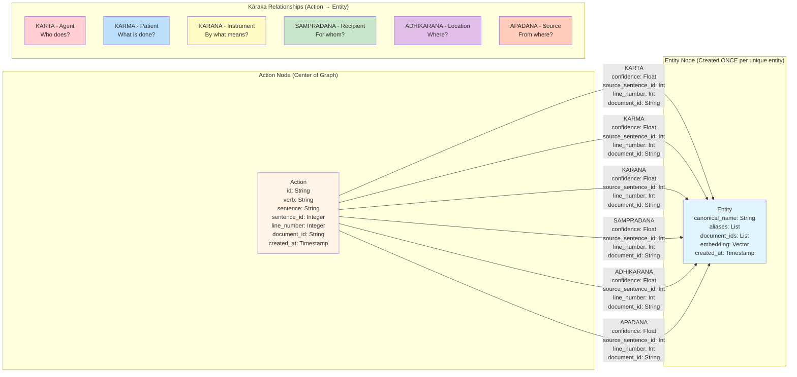

# Neo4j Graph Schema

## ⚠️ CRITICAL: Kriya-Centric Architecture

**The Kriya (Action) is the center. All relationships point FROM Action TO Entity.**

### ✅ CORRECT
```
(Action)-[KARTA]->(Entity)
(Action)-[KARMA]->(Entity)
```

### ❌ WRONG
```
(Entity)-[KARTA]->(Action)  // NEVER DO THIS!
```

## Schema Diagram



## Key Principles

### 1. Entity Node Reuse
**Each unique entity is created ONCE, then reused.**

Example: "Rama" appears 6 times → 1 entity node with 6 incoming relationships

```cypher
// ONE entity node
(:Entity {canonical_name: 'Rama', aliases: ['Rama', 'he']})

// MULTIPLE relationships to same node
(action_0)-[:SAMPRADANA]->(Rama)
(action_1)-[:KARTA]->(Rama)
(action_3)-[:KARTA]->(Rama)
```

### 2. No Direct Entity Connections
Entities are NEVER directly connected. Only through actions.

```
❌ WRONG: (Rama)-[:KNOWS]->(Lakshmana)
✅ CORRECT: (knows:Action)-[:KARTA]->(Rama)
            (knows:Action)-[:KARMA]->(Lakshmana)
```

### 3. Multi-Hop Reasoning
Traverse through action chains to trace relationships.

```cypher
// From where did Rama get the bow?
MATCH (a:Action)-[:SAMPRADANA]->(rama:Entity {canonical_name: 'Rama'})
MATCH (a)-[:KARMA]->(bow:Entity {canonical_name: 'bow'})
MATCH (a)-[:KARTA]->(giver:Entity)
RETURN giver.canonical_name
```

### 4. Temporal Ordering
Use sentence_id for chronological ordering.

```cypher
// What happened to the bow? (chronological)
MATCH (a:Action)-[r]->(bow:Entity {canonical_name: 'bow'})
RETURN a.verb, type(r), a.sentence
ORDER BY a.sentence_id
```

## Cypher Examples

### Create Entity (Once)
```cypher
MERGE (e:Entity {canonical_name: 'Rama'})
ON CREATE SET 
  e.aliases = ['Rama'],
  e.document_ids = ['doc_123'],
  e.embedding = $embedding,
  e.created_at = timestamp()
ON MATCH SET
  e.aliases = e.aliases + 'he',
  e.document_ids = CASE 
    WHEN 'doc_123' IN e.document_ids THEN e.document_ids 
    ELSE e.document_ids + 'doc_123' 
  END
```

### Create Action and Relationships
```cypher
// Create action
CREATE (a:Action {
  id: 'action_0',
  verb: 'gave',
  sentence: 'Rama gave bow to Lakshmana',
  sentence_id: 0,
  line_number: 1,
  document_id: 'doc_123'
})

// Link to existing entities (Action → Entity)
MATCH (a:Action {id: 'action_0'})
MATCH (rama:Entity {canonical_name: 'Rama'})
CREATE (a)-[:KARTA {confidence: 0.95, source_sentence_id: 0, line_number: 1}]->(rama)

MATCH (a:Action {id: 'action_0'})
MATCH (bow:Entity {canonical_name: 'bow'})
CREATE (a)-[:KARMA {confidence: 0.95, source_sentence_id: 0, line_number: 1}]->(bow)
```

### Query Pattern
```cypher
// Who gave bow to Lakshmana?
MATCH (a:Action)-[:KARTA]->(giver:Entity)
WHERE a.verb = 'gave'
MATCH (a)-[:KARMA]->(bow:Entity {canonical_name: 'bow'})
MATCH (a)-[:SAMPRADANA]->(recipient:Entity {canonical_name: 'Lakshmana'})
RETURN giver.canonical_name, a.sentence, a.line_number
```
