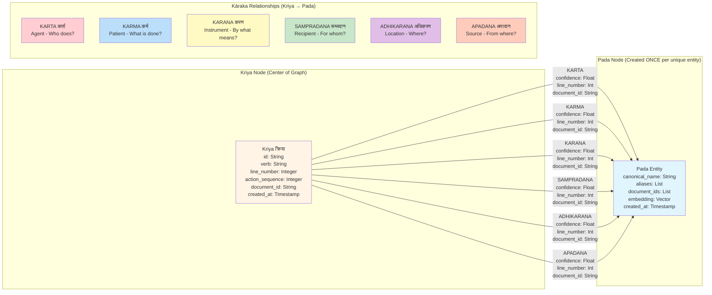

# Neo4j Graph Schema

## ⚠️ CRITICAL: Kriya-Centric Architecture

**The Kriya (क्रिया - verb/action) is the center. All Kāraka relationships point FROM Kriya TO Pada (entity).**

### ✅ CORRECT
```
(Kriya)-[KARTA]->(Pada)
(Kriya)-[KARMA]->(Pada)
```

### ❌ WRONG
```
(Pada)-[KARTA]->(Kriya)  // NEVER DO THIS!
```

## Schema Diagram



## Key Principles

### 1. Pada (Entity) Node Reuse
**Each unique pada is created ONCE, then reused.**

Example: "Rama" appears 6 times → 1 pada node with 6 incoming Kāraka relationships

```cypher
// ONE pada node
(:Pada {canonical_name: 'Rama', aliases: ['Rama', 'he']})

// MULTIPLE Kāraka relationships to same node
(kriya_0)-[:SAMPRADANA]->(Rama)
(kriya_1)-[:KARTA]->(Rama)
(kriya_3)-[:KARTA]->(Rama)
```

### 2. No Direct Pada Connections
Padas are NEVER directly connected. Only through Kriyas.

```
❌ WRONG: (Rama)-[:KNOWS]->(Lakshmana)
✅ CORRECT: (knows:Kriya)-[:KARTA]->(Rama)
            (knows:Kriya)-[:KARMA]->(Lakshmana)
```

### 3. Multi-Hop Reasoning
Traverse through Kriya chains to trace relationships.

```cypher
// From where did Rama get the bow?
MATCH (k:Kriya)-[:SAMPRADANA]->(rama:Pada {canonical_name: 'Rama'})
MATCH (k)-[:KARMA]->(bow:Pada {canonical_name: 'bow'})
MATCH (k)-[:KARTA]->(giver:Pada)
RETURN giver.canonical_name
```

### 4. Temporal Ordering
Use line_number for chronological ordering.

```cypher
// What happened to the bow? (chronological)
MATCH (k:Kriya)-[r]->(bow:Pada {canonical_name: 'bow'})
RETURN k.verb, type(r)
ORDER BY k.line_number, k.action_sequence
```

## Cypher Examples

### Create Pada (Once)
```cypher
MERGE (p:Pada {canonical_name: 'Rama'})
ON CREATE SET 
  p.aliases = ['Rama'],
  p.document_ids = ['doc_123'],
  p.embedding = $embedding,
  p.created_at = timestamp()
ON MATCH SET
  p.aliases = p.aliases + 'he',
  p.document_ids = CASE 
    WHEN 'doc_123' IN p.document_ids THEN p.document_ids 
    ELSE p.document_ids + 'doc_123' 
  END
```

### Create Kriya and Kāraka Relationships
```cypher
// Create Kriya (NO sentence text stored)
CREATE (k:Kriya {
  id: 'kriya_0',
  verb: 'gave',
  line_number: 1,
  action_sequence: 0,  // Order within line if multiple verbs
  document_id: 'doc_123',
  created_at: timestamp()
})

// Link to existing padas (Kriya → Pada via Kāraka)
MATCH (k:Kriya {id: 'kriya_0'})
MATCH (rama:Pada {canonical_name: 'Rama'})
CREATE (k)-[:KARTA {confidence: 0.95, line_number: 1}]->(rama)

MATCH (k:Kriya {id: 'kriya_0'})
MATCH (bow:Pada {canonical_name: 'bow'})
CREATE (k)-[:KARMA {confidence: 0.95, line_number: 1}]->(bow)
```

**Note:** Sentence text is NOT stored in nodes. Retrieve from original document using document_id + line_number when needed for display.

### Query Pattern
```cypher
// Who gave bow to Lakshmana?
MATCH (a:Action)-[:KARTA]->(giver:Entity)
WHERE a.verb = 'gave'
MATCH (a)-[:KARMA]->(bow:Entity {canonical_name: 'bow'})
MATCH (a)-[:SAMPRADANA]->(recipient:Entity {canonical_name: 'Lakshmana'})
RETURN giver.canonical_name, a.document_id, a.line_number

// Retrieve sentence text separately from document storage
// using document_id + line_number
```

### Multiple Kriyas in One Sentence

**Example:** "She called her team, scheduled a meeting, and sent an email."

**Graph Structure:**
```cypher
// Line 5 has 3 verbs → Create 3 action nodes

CREATE (a1:Action {id: 'action_5_0', verb: 'called', line_number: 5, action_sequence: 0, document_id: 'doc_123'})
CREATE (a2:Action {id: 'action_5_1', verb: 'scheduled', line_number: 5, action_sequence: 1, document_id: 'doc_123'})
CREATE (a3:Action {id: 'action_5_2', verb: 'sent', line_number: 5, action_sequence: 2, document_id: 'doc_123'})

// All link to same "she" entity
(a1)-[:KARTA]->(she)
(a2)-[:KARTA]->(she)
(a3)-[:KARTA]->(she)
```

**Key:** Multiple actions can share same line_number. Use action_sequence to distinguish order within the line.
