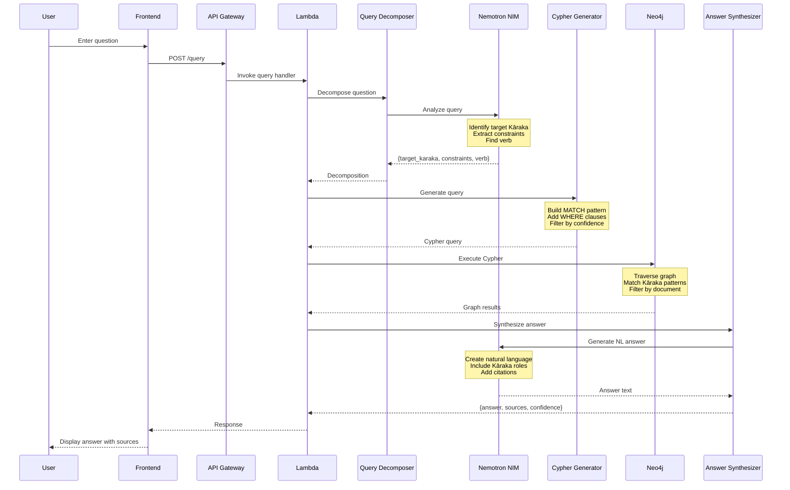
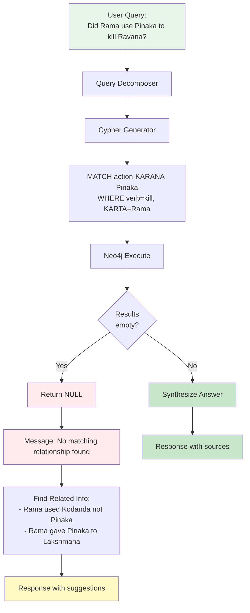

# Query Processing Flow




## No Answer Handling

### When No Matching Relationship Exists



### Response Format

**With Answer:**
```json
{
  "answer": "Rama used Kodanda to kill Ravana",
  "sources": [{
    "sentence_id": 7,
    "line_number": 8,
    "text": "Rama used the Kodanda to kill Ravana",
    "confidence": 0.95
  }],
  "confidence": 0.95
}
```

**No Answer:**
```json
{
  "answer": null,
  "message": "No matching relationship found",
  "related_findings": [{
    "text": "Rama used Kodanda (not Pinaka)",
    "sentence_id": 7,
    "line_number": 8
  }],
  "confidence": 0.0
}
```

**Key: Never hallucinate. Return NULL when no answer exists.**
