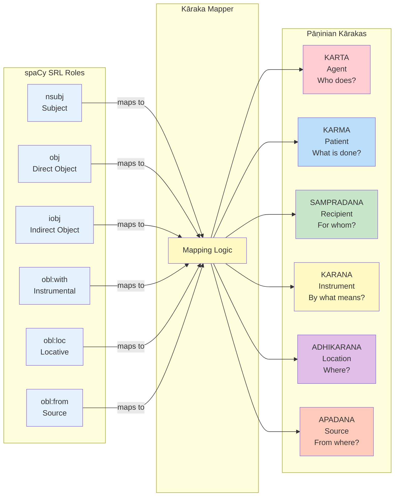

# SRL to Kāraka Mapping

```mermaid
flowchart LR
    subgraph "spaCy SRL Roles"
        S1[nsubj<br/>Subject]
        S2[obj<br/>Direct Object]
        S3[iobj<br/>Indirect Object]
        S4[obl:with<br/>Instrumental]
        S5[obl:loc<br/>Locative]
        S6[obl:from<br/>Source]
    end

    subgraph "Kāraka Mapper"
        M[Mapping Logic]
    end

    subgraph "Pāṇinian Kārakas"
        K1[KARTA<br/>Agent<br/>Who does?]
        K2[KARMA<br/>Patient<br/>What is done?]
        K3[SAMPRADANA<br/>Recipient<br/>For whom?]
        K4[KARANA<br/>Instrument<br/>By what means?]
        K5[ADHIKARANA<br/>Location<br/>Where?]
        K6[APADANA<br/>Source<br/>From where?]
    end

    S1 -->|maps to| M
    S2 -->|maps to| M
    S3 -->|maps to| M
    S4 -->|maps to| M
    S5 -->|maps to| M
    S6 -->|maps to| M

    M --> K1
    M --> K2
    M --> K3
    M --> K4
    M --> K5
    M --> K6

    style S1 fill:#e3f2fd
    style S2 fill:#e3f2fd
    style S3 fill:#e3f2fd
    style S4 fill:#e3f2fd
    style S5 fill:#e3f2fd
    style S6 fill:#e3f2fd
    style M fill:#fff9c4
    style K1 fill:#ffcdd2
    style K2 fill:#bbdefb
    style K3 fill:#c8e6c9
    style K4 fill:#fff9c4
    style K5 fill:#e1bee7
    style K6 fill:#ffccbc
```
