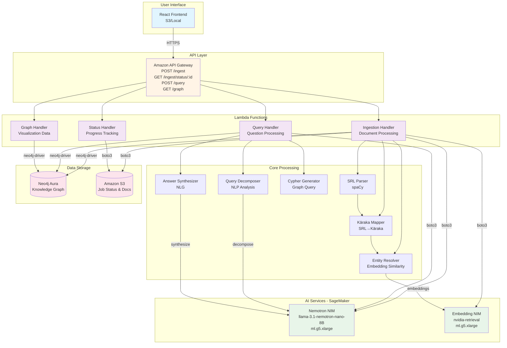

# System Architecture

```mermaid
graph TB
    subgraph "User Interface"
        UI[React Frontend<br/>S3/Local]
    end

    subgraph "API Layer"
        APIGW[Amazon API Gateway<br/>POST /ingest<br/>GET /ingest/status/:id<br/>POST /query<br/>GET /graph]
    end

    subgraph "Lambda Functions"
        L1[Ingestion Handler<br/>Document Processing]
        L2[Status Handler<br/>Progress Tracking]
        L3[Query Handler<br/>Question Processing]
        L4[Graph Handler<br/>Visualization Data]
    end

    subgraph "AI Services - SageMaker"
        NIM1[Nemotron NIM<br/>llama-3.1-nemotron-nano-8B<br/>ml.g5.xlarge]
        NIM2[Embedding NIM<br/>nvidia-retrieval<br/>ml.g5.xlarge]
    end

    subgraph "Core Processing"
        SRL[SRL Parser<br/>spaCy]
        KM[Kāraka Mapper<br/>SRL→Kāraka]
        ER[Entity Resolver<br/>Embedding Similarity]
        QD[Query Decomposer<br/>NLP Analysis]
        CG[Cypher Generator<br/>Graph Query]
        AS[Answer Synthesizer<br/>NLG]
    end

    subgraph "Data Storage"
        NEO[(Neo4j Aura<br/>Knowledge Graph)]
        S3[(Amazon S3<br/>Job Status & Docs)]
    end

    UI -->|HTTPS| APIGW
    APIGW --> L1
    APIGW --> L2
    APIGW --> L3
    APIGW --> L4

    L1 -->|boto3| NIM1
    L1 -->|boto3| NIM2
    L1 --> SRL
    L1 --> KM
    L1 --> ER
    L1 -->|neo4j-driver| NEO
    L1 -->|boto3| S3

    L2 -->|boto3| S3

    L3 -->|boto3| NIM1
    L3 --> QD
    L3 --> CG
    L3 --> AS
    L3 -->|neo4j-driver| NEO

    L4 -->|neo4j-driver| NEO

    SRL --> KM
    KM --> ER
    ER -->|embeddings| NIM2
    QD -->|decompose| NIM1
    AS -->|synthesize| NIM1

    style UI fill:#e1f5ff
    style APIGW fill:#fff4e6
    style L1 fill:#f3e5f5
    style L2 fill:#f3e5f5
    style L3 fill:#f3e5f5
    style L4 fill:#f3e5f5
    style NIM1 fill:#e8f5e9
    style NIM2 fill:#e8f5e9
    style NEO fill:#fce4ec
    style S3 fill:#fce4ec
```
