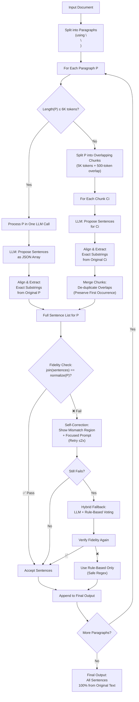

```mermaid
flowchart TD
    A[Input Document] --> B["Split into Paragraphs\n(using \\n\\n)"]
    B --> C["For Each Paragraph P"]

    C --> D{"Length(P) ≤ 6K tokens?"}
    D -- "Yes" --> E["Process P in One LLM Call"]
    D -- "No" --> F["Split P into Overlapping Chunks\n(5K tokens + 500-token overlap)"]

    E --> G["LLM: Propose Sentences\nas JSON Array"]
    F --> H["For Each Chunk Ci"]
    H --> I["LLM: Propose Sentences\nfor Ci"]

    G --> J["Align & Extract\nExact Substrings\nfrom Original P"]
    I --> K["Align & Extract\nExact Substrings\nfrom Original Ci"]

    K --> L["Merge Chunks:\nDe-duplicate Overlaps\n(Preserve First Occurrence)"]
    J --> M["Full Sentence List for P"]
    L --> M

    M --> N{"Fidelity Check:\njoin(sentences) == normalize(P)?"}
    N -- "✅ Pass" --> O["Accept Sentences"]
    N -- "❌ Fail" --> P["Self-Correction:\nShow Mismatch Region\n+ Focused Prompt\n(Retry ≤2x)"]

    P --> Q{"Still Fails?"}
    Q -- "Yes" --> R["Hybrid Fallback:\nLLM + Rule-Based Voting"]
    Q -- "No" --> O

    R --> S["Verify Fidelity Again"]
    S -- "✅" --> O
    S -- "❌" --> T["Use Rule-Based Only\n(Safe Regex)"]

    O --> U["Append to Final Output"]
    T --> U

    U --> V{"More Paragraphs?"}
    V -- "Yes" --> C
    V -- "No" --> W["Final Output:\nAll Sentences\n100% from Original Text"]
```